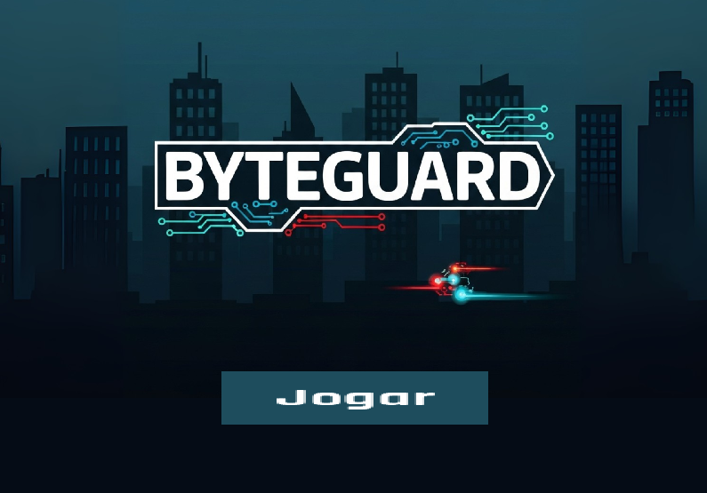
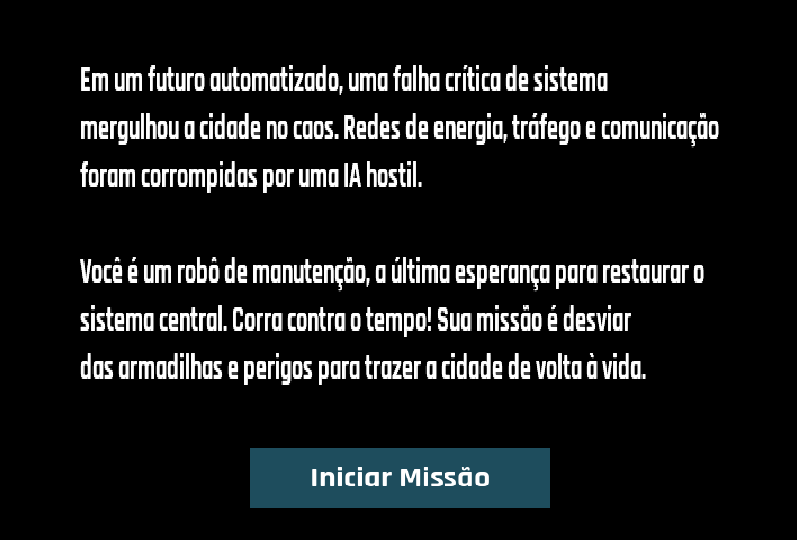
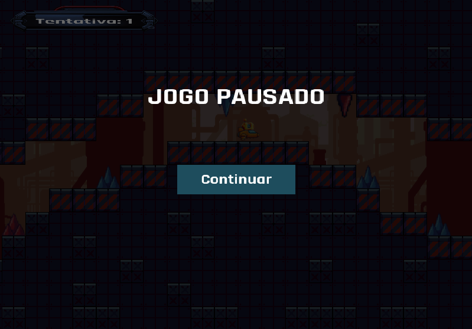
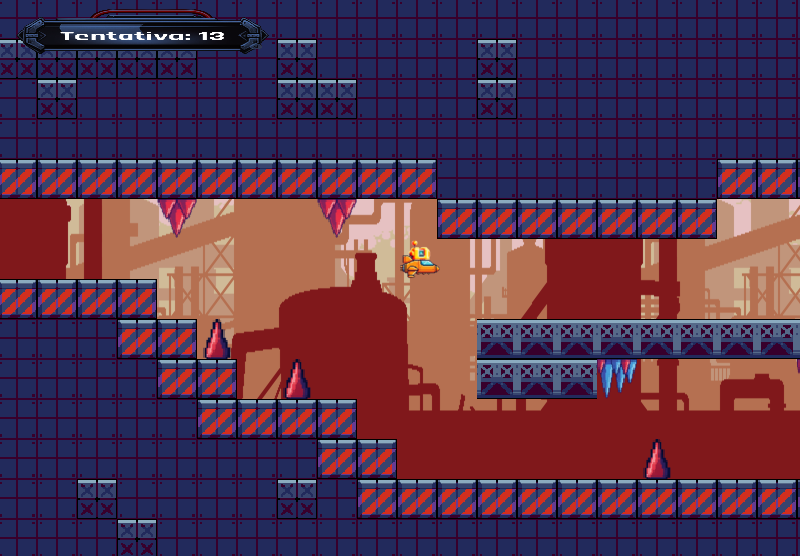
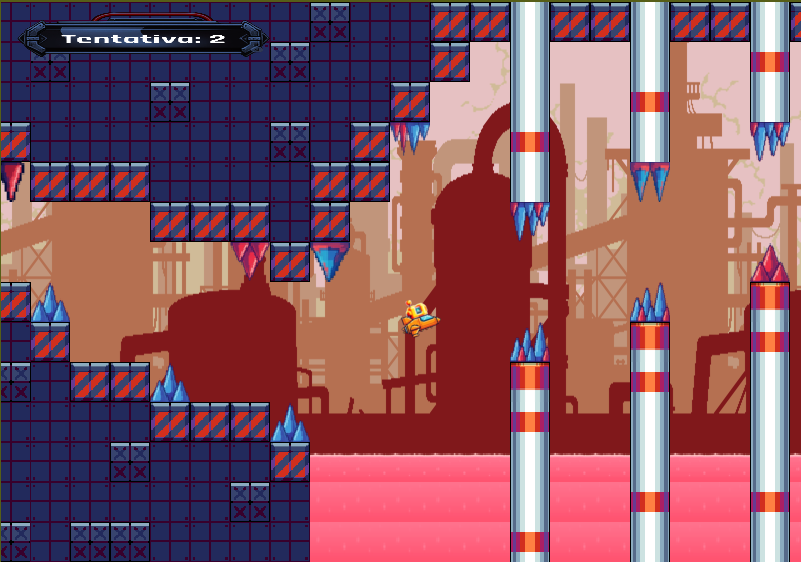

# ByteGuard

## Screenshots
- Menu Principal

- Tela de história:

- Menu de pausa:

- Fase 2

## Nome do jogo
**ByteGuard**
## Descrição

***ByteGuard*** é um jogo de plataforma no estilo _auto-runner_ com inspiração em títulos como "Geometry Dash", mas que aposta em uma narrativa leve para dar contexto à ação. O jogador controla um robô de manutenção ativado emergencialmente para recuperar setores de uma cidade futurista em colapso. A proposta é oferecer uma experiência com ritmo acelerado, com controles simples e desafios crescentes, buscando motivar o jogador a seguir até o fim.

A mecânica principal gira em torno do salto, usado para desviar de obstáculos presentes nos mapas a serem enfrentados enquanto o personagem corre automaticamente da esquerda para a direita, podendo acelerar ou frear na corrida, mas sempre tomando cuidado para não ser pego pelo míssil se for devagar demais. Esses desafios fazem parte de um sistema sabotado por uma inteligência artificial rebelde. Durante o percurso, há uma vantagem coletável que buscam facilitar a travessia, um *power-up*, que é uma possibilidade de desaceleração do tempo, o que abre espaço para caminhos alternativos. A dificuldade aumenta ao passar do jogo, entretanto, o jogo é desafiante do início ao fim, dependendo de agilidade, reflexos e memorização para conseguir alcançar o objetivo final.

O objetivo é concluir as fases, que nesse momento de desenvolvimento são duas, e conseguir restaurar a ordem no mundo. Cada falha reinicia a fase, reforçando o sistema de tentativa e erro como forma de aprendizado. A progressão é marcada tanto pela dificuldade quanto pela história, que avança conforme o jogador restaura os setores da cidade, reforçando a sensação de avanço e propósito.

## Funcionalidades a serem testadas

**Funcionalidades gráficas:**
- Funcionamento do menu, com os sons de fundo e de aperta o botão de início do jogo.
- Funcionalidade de *pause* do jogo, verificando se as pausas estão graficamente viáveis e não interferem no andamento do jogo.
- Funcionalidade da tela de texto para contar a narrativa do jogo, verificando se está transicionando correto entre as telas.

**Funcionalidades de jogabilidade:**
- Testar a dificuldade do jogo, se os locais para passar estão muito apertados e se é possível chegar aos objetivos finais.
- Testar a colisão, se as colisões físicas não estão coincidindo com as colisões dos objetos desenhados graficamente.
- Testar o *power-up*, apertando a tecla 'Q' após coletá-lo, verificando se realmente terá a redução do tempo.
- Testar os controles de aceleração e freio do personagem na fase 1, se estão funcionando como devem, ou seja, se estão acelerando e freando o personagem.
- Testar, na fase 2, o sistema de voo do personagem, se está muito complexo, subindo ou descendo muito rápido ou muito devagar.
- Testar a troca de cena, ao chegar no final da fase 1, se o jogador irá para a fase 2 corretamente.

## Créditos
- Diogo Alves Graciano: Desenvolvimento da fase 2 e de elementos gráficos.
- Lucas Wiermann Cobo da Silva: Desenvolvimento da fase 1 e da física do jogo.